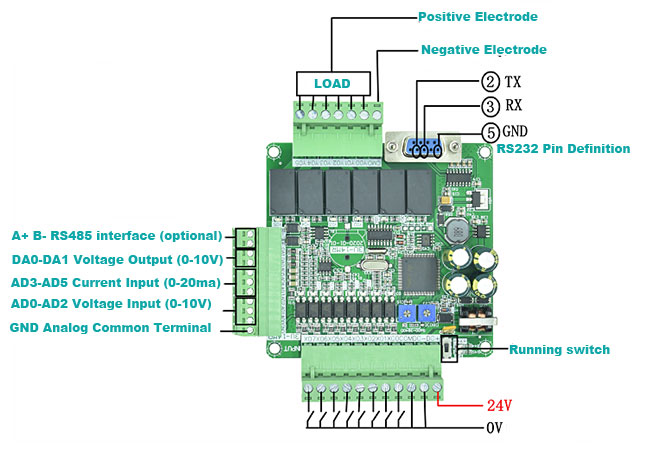

# Mitsubishi FX communication protocol implementation (FX-232AW)
[Available on Github here!](https://github.com/Ramy-Sorial/Mitsubishi_FX_Ptotocol.git)
__Developed on the Chinese FX3U PLCs like the one in the below picture__



Based on the following document [Link](http://www.inverter-plc.com/plc/melsec/FX-232AW%20USER%20MANUAL.pdf)

## Contents
1. [Protocol Details](#protocol-details)
2. [Usage Example](#usage-example)
3. [Parser Capabilities](#parser-capabilities)
4. [Extending the interface capabilities](#extending-the-interface-capabilities)
5. [Limitations](#Limitations)
6. [Compatibility] (#Compatibility)


## Protocol Details
The protocol works over RS232, below are the default communication params
- Baud Rate: `38400`
- Parity: `Even`
- Data Bits: `7`
- Data format: `ASCII`

The protocol allows the remote PC to read the below types:

`Misubishi_FX_Protocol.cs`
```cs
    public enum RegisterType : byte
    {
        State, //S000-999
        Input_Contact, //X0-X127 (in Octal)
        Output_Contact,//Y0-Y127 (in Octal)
        Timer_Contact, //T0-255
        Contact, //C0-255
        Memory_Contact, //M0-1023
        M_Special,// M8000-8255
        Counter_32B, //C200-C255
        Timer_Counter_16B, //T0-255
        Data,   //D0-511
        Data_Special, /D8000-8255
        Counter_16B,//C0-C199
    }

```
As for writing data, the only successfully tested numeric type was the Data type `D`.
For the below types, you can force individual bits to ON or OFF:

`Misubishi_FX_Protocol.cs`
```cs
    public enum RegisterType : byte
    {
        State, //S000-999
        Output_Contact,//Y0-Y127 (in Octal)
        Contact, //C0-255
        Memory_Contact, //M0-1023
        M_Special,// M8000-8255
    }
```
## Usage Example
- First, create a transport layer instance (`MFX_SerialTP`), this will be used by the `MFX_Protocol` to communicate with the CPU.
- Then create an `MFX_Protocol` instance and pass the Serial transport layer instance to it.
- Start the interface, this will open the serial port.
```cs
    MFX_SerialTP serial = new MFX_SerialTP("COM5", 38400, System.IO.Ports.Parity.Even, System.IO.Ports.StopBits.One, 7, 1000);

    MFX_Protocol CPU;
    CPU = new MFX_Protocol(serial);
    bool OK = CPU.Start();

```

- All operations return a `MFX_State` which can be any of the below cases:

`Misubishi_FX_Protocol.cs`
```cs
public enum MFX_State
{
  OK, //Success
  Error_Ack, //recieved an NACK from CPU
  Error_Timeout, //no responce recieved from CPU
  Error_CRC, // CRC error in the CPU response
  Error_TX, // itranslayer transmission problem
  Error_Incorrect_Address, // incorrect address format, for ex. Y8 (X and Y are supposed to be Octal numbers)
  Error_Too_Many_Bytes, // bytes to read/write are > 64 bytes which is the COU transfer limit, try reducing the data size
  Error_Address_Incorrectly_Aligned, //when writing bits, make sure the base address is in the multiples of 8, for ex(M10 is wrong, M8 should be OK)
  Error_Incorrect_Data_Type, // ex. requesting a D type in a bit read/write
  Error_Address_Out_Of_Range, //requesting output no.900 while the max is 177
  Processing, //intermediate state indicating that the communication is in progress
}
```
- Below is how you can read bit data from the CPU
```cs
bool[] ReadData;
//read Y10 for 2 --> Y10, Y11
var Result = CPU.ReadBitData(RegisterType.Output_Contact, 10, 2, out ReadData);
```
- to read numeric data 16-bit size
```cs
ushort[] ReadData;
//read C6 & C7 into ReadData[0] & ReadData[1]
var Result = CPU.ReadNumericData_16B(RegisterType.Counter_16B, 6, 3,out ReadData);
```
- To write Numeric Data
```cs
ushort[] Data = new ushort[] { 1000, 2000 };
//D20 --> 1000 & D21 = 2000
var Result = CPU.WriteNumericData_16B(RegisterType.Data, 20, 2, Data);
```
- To force single bits
```cs
//now M500 will be forced to '1'
var Result = CPU.Force_Bit(RegisterType.Memory_Contact, 500, true);
```
## Parser Capabilities
The FX CPU supports the below double word data types:
1. unsigned double word --> `32-bit unsigned`
2. signed double word --> `32-bit signed`
3. single precision wouble word --> `32-bit float`  

To read/write such variables, the parser functions are used, below is an example for read:
Assuming the below variables inside the CPU:
- `D0-1` `float`
- `D2-3` `UInt32`
- `D4-5` `Int32` 

### reading from the CPU
```cs
ushort[] Data;
var Result = CPU.ReadNumericData_16B(RegisterType.Data, 0, 8, out Data);
int Offset = 0;

float F = MFX_Protocol.ParseFloat(Data, Offset); Offset += 2;
UInt32 G = MFX_Protocol.ParseUInt32(Data, Offset); Offset += 2;
Int32 H = MFX_Protocol.ParseInt32(Data, Offset); Offset += 2;
```

### Writing to the CPU
```cs
ushort[] Data = new ushort[6];

int Offset = 0;

MFX_Protocol.EncodeFloat(ref Data, Offset, 1.25f); Offset += 2;
MFX_Protocol.EncodeUInt32(ref Data, Offset, 150000); Offset += 2;
MFX_Protocol.EncodeInt32(ref Data, Offset, -160000); Offset += 2;
var t = CPU.WriteNumericData_16B(RegisterType.Data, 0, (byte)Offset, Data);
```

## Extending the interface capabilities
It is possible to exend the capabilities of the interface libraries by implementing various `ItransLayer` classes.

## Limitations
The project is still work in progress, however, the following limitations were observed:
1. 1. Writing multiple bits
2. Writing any numeric data other than the `D` type

## Compatibility
The code was tested on a chinese clone **FX3U-24MT** CPU